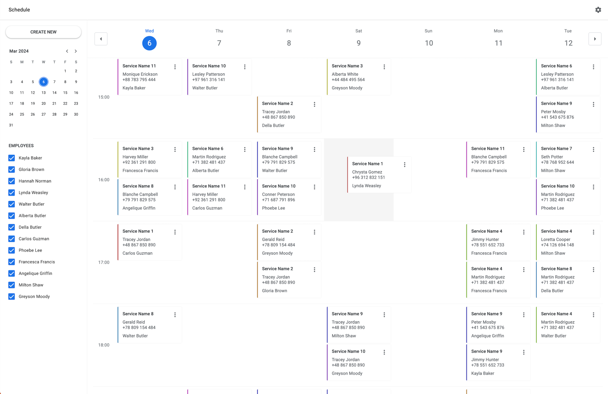

# @foblex/ng-drag-grid Demo

This is a demo project for `@foblex/ng-drag-grid`, an Angular library that facilitates a clean architecture with better command-query separation for implementing drag-and-drop grid functionalities.

[Drag Grid Library](https://github.com/siarheihuzarevich/f-ng-calendar-demo)

[DEMO](https://github.com/siarheihuzarevich/f-ng-calendar-demo)

## License

This demo project is distributed under the MIT License. See the LICENSE file for more information.
